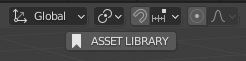
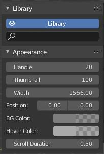

# Asset Library for Blender

This is just concept and not ready for production.  
Discontinued since blender 3.0 already have its own asset library

# Preview

## Opening the asset Library

- Using BGL (blender open gl) to generate image preview instead of loading the image in blender so it didn't store any unused textures in the file itself

## Search Function of the Asset Library

- Hover over asset library and start typing to filter asset list

## Asset Library UI Customization
- Adjustable Position

- Adjustable Size of Thumbnail

- Adjustable Size of Handle

- Adjustable Color

- Adjustable animation duration

